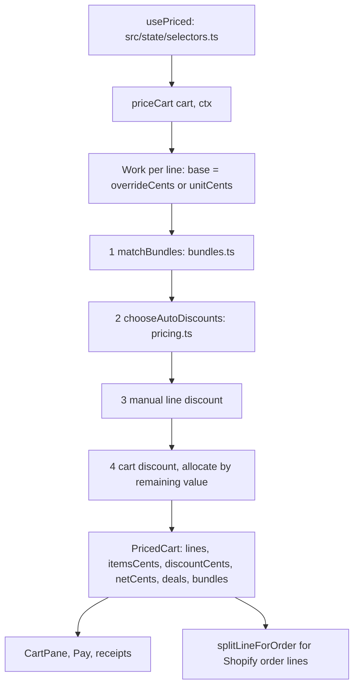

The cart is the list of what the customer is buying. The total at the bottom is always the final price after every deal.

## Basic

### Reading a line
Each line shows the item and variation, then **quantity × price** (for example *13 × $4.00*). If a discount applies, the full price is struck through with the final price beside it, and each discount sits on its own green row underneath with the amount taken off. A deal that applied more than once shows **(x2)** after its name.

### Changing a line
- **Swipe left** on a line to remove it (let go past halfway and tap the red button, or swipe all the way across).
- **Tap** a line to edit it:
  - **− / +** change the quantity (going to 0 removes the line).
  - **Variation** chips swap to another variation of the same product.
  - **Discount** puts a percentage or dollar discount on this line only.
  - **Price adjustment** sets a new unit price for this sale only. **Reset to catalogue price** undoes it.
  - **Note** adds a note to the line.
  - **Remove item** takes it out.

### The customer
Tap the person row at the top of the cart to add a customer to the sale, or the small ✕ to take them off. You can create a new customer from the ••• menu.

### The ••• menu
**Clear cart**, **Save cart** (for later; see saved carts), **Create customer**, **Custom amount**, **Apply cart discount**, **Sell gift card**, **Check gift card**, and **Check change** (can we make change for this cart?).

### Bundle deals
When items in the cart qualify for a bundle deal, a **Bundle deals** block appears under the lines with one card per deal, naming each item and variation and the saving. A card may say **Recommended pair** or **Not a recommended pair**. The customer gets the deal either way. When you press **Charge** with a "not a recommended pair" bundle in the cart, a sheet shows it once so you can check it is what the customer wants (**Edit cart** or **Continue to payment**).

### What cannot be discounted
Gift cards, custom amounts, and any item tagged `no-discount` in Shopify. Their line shows "Not discountable" in the editor.

### The total
Above the **Charge** button you see **Items** (the full price), each deal in green with its saving, and the final amount on the button. The count underneath is the total number of items.

## Deep

### The order discounts are applied in
The price is built in four steps, always in this order:
1. **Bundle deals** (the deals you set up in Settings ▸ Discounts & bundles).
2. **Automatic discounts** imported from Shopify.
3. **The line's own discount** (the one you set in the line editor).
4. **The cart discount.**

Each step works on what is left after the one before it, and a discount never takes a line below $0.

### Rules that follow from that
- A single unit can be part of **one** bundle deal or **one** automatic discount, never two. Several different deals can apply in the same order, and the POS picks the combination with the biggest total saving for the customer.
- A line that received a bundle discount does **not** also get its own line discount.
- The cart discount is spread over the remaining value of every line that can be discounted, in proportion to that value. The pieces add up exactly: no cent is lost or invented.
- A percentage is rounded to the nearest cent (half up).
- The POS works out Shopify's automatic discounts itself, so the total on screen is instant and works offline. Shopify's own "combines with" settings are not read.

### A worked example
A customer buys 2 Highland cows and 8 Tadlings. The shop has an automatic deal for 2 cows ($2 off), one for 3 Tadlings ($5 off) and one for 5 Tadlings ($10 off). The cows get the $2 deal. Of the 8 Tadlings, 5 take the $10 deal and the other 3 take the $5 deal, so the Tadling line shows two discount rows, **5x Tadlings** (−$10) and **3x Tadlings** (−$5). (The prices here are only to show the shape.)

### Price adjustment versus discount
A price adjustment replaces the item's unit price before any discount is worked out, so a discount is then taken off the adjusted price. A line with an adjustment, a discount or a note does not merge with a plain line of the same item when you add it again.

### Prices sent to Shopify
Shopify needs a whole-cent price per unit. When a line's final price does not divide evenly, the POS splits it into at most two groups of units that differ by one cent, so the pieces add up to the line total exactly. For example, $10.00 for 3 units becomes 2 units at $3.33 and 1 unit at $3.34.

## Advanced

### The pricing pipeline

### Where the code is
| Job | Where |
|---|---|
| The whole pipeline | `priceCart` in `src/lib/pricing.ts` |
| Running it live | `usePriced` in `src/state/selectors.ts` (re-runs when the cart, catalogue, automatic discounts or the bundles setting change) |
| Bundle matching | `matchBundles` in `src/lib/bundles.ts` |
| Automatic discounts | `chooseAutoDiscounts`, `autoMove`, `isLot`, `activeNow` in `src/lib/pricing.ts` |
| Clamping a discount to what is left | the local `add` in `priceCart` (`Math.min(d.cents, remaining(w))`) and `remaining` |
| Percent and spreading cents | `pctOf`, `allocate` in `src/lib/money.ts` |
| Which lines are discountable | `discountable` in `priceCart`: not `gift_card`, not `noDiscount`, no `no-discount` tag (`NO_DISCOUNT_TAG`) |
| Rows shown in the cart | `invoiceRows`, `unitLine` in `src/lib/invoiceRows.ts` |
| The cart screen | `src/screens/CartPane.tsx`; the line editor `LineEditor` in `src/screens/sheets.tsx` |
| Splitting for Shopify | `splitLineForOrder` in `src/lib/pricing.ts` |
| Tests | `tests/compound.test.ts`, `tests/autocombine.test.ts`, `tests/bundleform.test.ts`, `tests/swipe.test.ts` |

### The data it returns
`PricedCart` has `lines` (each with `baseUnitCents`, `grossCents`, `discounts`, `discountCents`, `netCents`, `bundleUnits`), the cart totals `itemsCents`, `discountCents` and `netCents`, `deals` (the discounts rolled up by type and label, which is what the totals area lists), and `bundles` (one entry per bundle application, with the units it used). Each entry in `discounts` has a `type` (`bundle`, `auto`, `manual` or `cart`), a `label`, `cents`, and for repeated deals a `times` count.

### Reading the code for a fault
- **A deal you expect did not apply.** Check, in order: is the line discountable (tag, `noDiscount`, gift card or custom amount)? Is the discount inside its dates (`activeNow` compares `startsAt` and `endsAt`)? Does the line's product, variation or collection match the discount's target (`matches`)? For a bundle, check its on/off switch, dates and "most times per order" in the bundle editor.
- **A line discount you set vanished from the receipt.** The line also got a bundle discount, and step 3 skips lines that did (`w.discounts.some(d => d.type === 'bundle')`).
- **The total is a cent out against Shopify.** Compare `splitLineForOrder` output with the order lines; the groups must add to `netCents`.
- **A discount seems to apply to the wrong line.** The cart discount is spread over every discountable line, so each gets a share; look at the per-line `discounts` array, not just the rolled-up `deals`.
- **Debugging a cart.** Call `priceCart` from a test with the same cart and context as the sale (see `tests/autocombine.test.ts` for how a context is built).

### Known to change
The single "Price adjustment" on a line is planned to be replaced by Line, Item and Whole-order adjustments with a review step (checklist item A16). This page will be updated when that is built.
