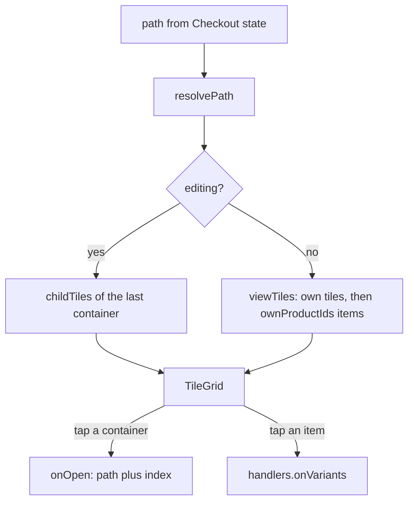

The Quick Menu is your own layout of buttons. You decide what is on it, how it is grouped, and what colour each button is.

## Basic

### What a tile can be
- **Item**: adds that product to the cart. If it has several variations you pick one first (see [[sales/variants-and-stock]]).
- **Category**: opens inside to show its own tiles, then every product in that Shopify collection. The photo on the tile is the collection's picture.
- **Display group**: a folder you fill yourself with any tiles you like. It can optionally act like a collection too.
- **Action**: a button that does a job: Custom amount, Sell gift card, Clear cart, Create item, Customers, Discounts, Cart discount, Saved carts, Switch staff, Lock POS, Price check, Stock check, Check change.
- **Discount**: applies a percentage or dollar discount to the whole cart.

A small dot on an item tile shows its stock: green is fine, amber is low (2 or fewer), red is oversold (below zero). No dot means the stock is not tracked.

### Moving around
When you open a category or group, a bar above the tiles shows where you are, for example *Home > Dragons > Highland cow*. Tap any earlier name to jump back to it, or use the back arrow to go up one step. Categories can sit inside categories as deep as you like.

### Changing the grid
1. On Checkout, with **Quick Menu** selected, tap the **pencil** at the top. It turns into a green tick.
2. **Tap a tile** to change it: its label, its colour, and for a category or group what it shows and what is inside it.
3. The **red minus** at a tile's top-left removes it. The **arrows** at its bottom-right move it earlier or later.
4. The dashed **+** tile adds something: Items, Categories, Display groups, Actions or Discounts.
5. Tap the green tick when you are done.

You are editing the level you are standing in. Open a category first to change what is inside it. Everything saves as you go, and your other registers get the change shortly afterwards.

### Pages
If you have more than one page, a row of page names sits above the tiles. While editing, a **Pages** button (or tapping the current page's name) opens a list where you can rename the page, add a new one, move pages up and down, or delete one. You cannot delete the last page.

### Tile size
Settings ▸ Theme ▸ **Tile size** (Small, Medium or Large) changes how many tiles fit across.

### Missing tiles
A greyed tile saying **Missing item** or **Missing category** points at something that no longer exists in Shopify. Remove the tile, or import your products again in Settings ▸ Shopify if it should still be there.

### Moving a layout in or out
Settings ▸ **Grid import / export** lets you paste or pick a `grid.json` file, export your grid, or push the layout to your other registers right now. Any tile that cannot be understood is skipped, and you are told how many.

## Deep

### Category or display group?
A **category** is tied to a Shopify collection. Open it and you see the tiles you put inside it first (usually sub-categories), then the products in the collection. A **display group** is just your own folder with its own tiles. If you switch on "Acts like a collection" for a group, it shows that collection's products after its tiles, like a category does.

### Which products show where
If a product belongs to both a category and one of that category's sub-categories (at any depth), it only shows in the deepest one. This stops the same product appearing in every level. A product you pin yourself as an **Item** tile is never hidden by this, and it is not shown twice in the same place.

### One product or one variation
An Item tile can point at a whole product (the picker appears if it has several variations) or at one specific variation (it is added straight away). Tiles you add from a product use the whole product.

### What editing shows
While editing, a category shows only the tiles stored inside it, not its collection's products, because those are filled in automatically and cannot be moved. A note under the grid says so.

### Shared between registers
The layout is stored in Shopify, so every register shows the same grid. After you change something, the new layout is sent about a second and a half later. Each register checks for a newer layout about every 25 seconds while the app is open, and when it returns to the front. A layout that cannot be read is ignored, so a bad import cannot blank another register.

## Advanced

### The data
```text
{ "version": 1, "pages": [ { "id": "...", "name": "Home", "tiles": [ ... ] } ] }
```
A tile is one of five shapes, from `src/lib/grid.ts`:

| `type` | Fields |
|---|---|
| `action` | `action` (one of `ACTIONS`), optional `label`, `color` |
| `category` | `collectionId`, optional `label`, `color`, `subs` (more tiles) |
| `item` | `variantId` or `productId`, optional `label`, `color` |
| `discount` | `code`, `pct` or `amtCents`, optional `label`, `color` |
| `group` | `name`, `tiles`, optional `collectionId`, `color` |

`parseGrid` accepts a JSON string or object, drops any tile that fails `isTile` (counting them in `dropped`), and always returns at least one page. A new install gets `defaultGrid()`: one Home page with every action except Cart discount.

### Paths and nesting
`src/lib/gridNav.ts` is pure and works on a **path**: a list of tile indexes, one per level (`[2, 0]` is tile 2 on the page, then tile 0 inside it). `resolvePath` walks it and stops at the first step that no longer exists, so a layout change from another register cannot leave a screen pointing at nothing. `listAt`, `editListAt`, `updateTileAt`, `addTileAt`, `removeTileAt` and `moveTileAt` return changed copies and never edit in place.



`ownProductIds` implements the deepest-wins rule: it removes any product found in `descendantCollectionIds`. `viewTiles` also skips a product already pinned as an item tile inside the container. `breadcrumbs` builds the bar from the resolved nodes.

### Where the code is
| Job | Where |
|---|---|
| Edit mode, page chips, path state | `Checkout.tsx` (`editing`, `pageIdx`, `path`, `edit`, `editPage`) |
| Drawing tiles, the add sheet | `Tiles.tsx` (`TileGrid`, `TileView`, `AddTileSheet`) |
| Tile settings sheet | `TileSettings.tsx` (`TileSettingsSheet`) |
| Saving and sharing | `commitGrid` in `Tiles.tsx` (saves at once, `pushLayout` after 1.5 s) |
| Push and pull | `pushLayout`, `pullLayout` in `src/lib/sync.ts`; stored in the `pos_layout` metaobject with a `version` |
| Import and export | `GridSettings` in `Settings.tsx` |
| Tests | `tests/gridnav.test.ts` |

### Reading the code for a fault
- **A change did not reach another register.** `pullLayout` only applies a layout whose `version` is higher than that register's `gridVersion`. Check the register is online (the strip on Checkout), then Settings ▸ Grid import / export ▸ Push layout now.
- **Items missing from a category.** Either the collection has no products on this device (import again) or the products also sit in a sub-category (`ownProductIds`).
- **Import said "N unsupported tiles skipped".** Those failed `isTile`: an unknown `type`, an `action` that is not in `ACTIONS`, or an item with neither `variantId` nor `productId`.
