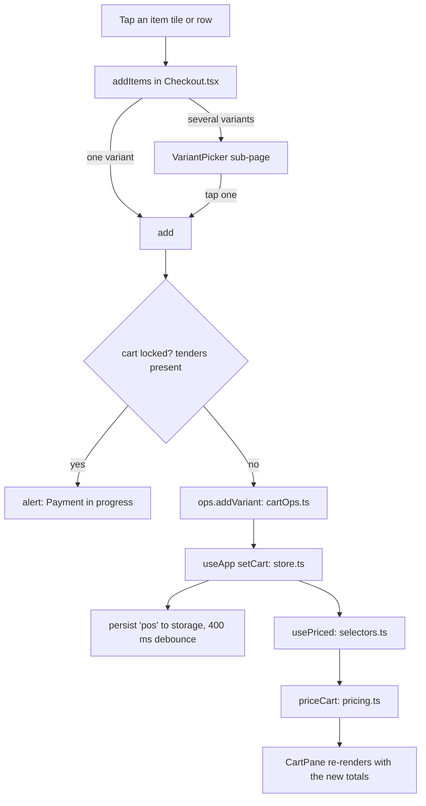
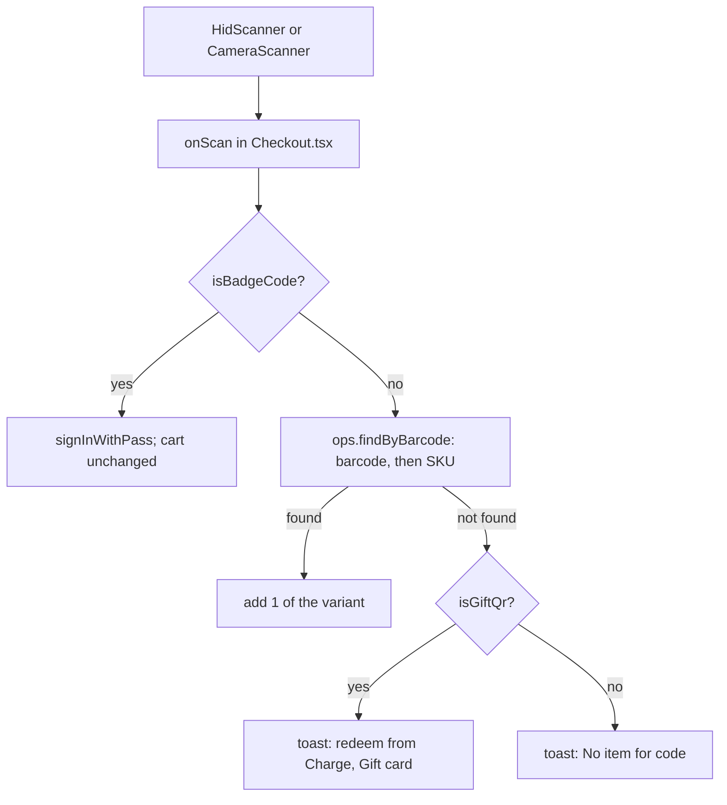

Checkout is where every sale starts. You add things to the cart here, then press **Charge** to take payment.

## Basic

### The three ways to add items
At the top of the left side, pick one:
- **Quick Menu**: your grid of tiles (items, categories, discounts and action buttons). This is the fastest way for the things you sell most.
- **All products**: every product in alphabetical order, with a filter box. Use it for anything that is not on the grid.
- **Keypad**: key in an amount and press **Add** for something with no item. It goes in the cart as a "Custom amount".

On the Quick Menu, a tile that opens a **category** takes you into it. The bar above the tiles shows where you are (for example *Home > Dragons > Highland cow*). Tap any earlier name to jump back there, or tap the arrow to go back one step.

### Items with several variations
If a product has more than one variation (a colour or size), tapping it replaces the grid with one tile per variation. Tap the one you want and it is added, then you are back where you were. Out-of-stock variations can still be sold: the stock count is allowed to go below zero, and the screen warns you with "stock will go negative".

### Adding more than one
Pick **×2**, **×3**, **×5** or **×10** first, then tap the item. The count applies to that one item and then goes back to ×1.

### Other ways to find things
- **Search** (the bar at the top): finds items (by name, variation, SKU or barcode), customers, discounts and saved carts. Tap a result to use it.
- **Scan**: a Bluetooth scanner works whenever you are on Checkout and no pop-up is open. The camera icon scans with the iPad's camera. A scanned item is added straight away.
- Scanning a **cashier pass** signs that person in (your cart stays as it is). Scanning a **gift card QR** here tells you to redeem it from Charge ▸ Gift card.

### The cart
On an iPad the cart is always on the right. On a phone, a bar at the bottom shows the item count and total; tap it to open the cart. Press **Charge** when you are ready. Details are on [[sales/cart-and-prices|The cart and how prices are worked out]].

### The strip under the search bar
On an iPad it always shows **Reader ready** and **Synced** when all is well. If something is wrong you get an amber or red button instead ("Reader issue", "Offline · 2 queued", "Sync issue"). Tap it to go to the page that explains it. On a phone the strip only appears when there is a problem.

### When you cannot change the cart
Once part of a sale has been paid, the cart is locked and you see "Payment in progress". Finish the payment or cancel it first.

## Deep

### Why a tap does different things
A tile is one of several kinds: an item, a category, a display group, a discount, or an action (such as Custom amount, Lock POS, Price check, Stock check or Check change). Items and variations go into the cart; categories and groups open a level of the grid; discounts apply to the whole cart; actions open a sheet or do a job. Categories can contain categories to any depth.

### What "consolidate" means
By default, adding the same item again raises the quantity on its existing line instead of making a second line. A line is **not** merged into if it has been changed in some way (its price adjusted, a discount put on it, or a note added), because merging would mix a special line with a normal one. This can be turned off in Settings (Checkout ▸ Consolidate identical items).

### How scanning finds an item
A barcode is compared after removing spaces and leading zeros, so a 12-digit UPC and a 13-digit EAN with a leading 0 match the same item. If no barcode matches, the scan is tried as an exact SKU. If nothing matches you see "No item for …".

### Why the grid sometimes does not show an item you expect
An item that sits in both a sub-category and its parent category shows only in the sub-category. Items you pin yourself as tiles are never hidden by that rule.

### Your cart is saved as you go
Every change to the cart is written to the device (after a very short delay), so closing the app does not lose it.

## Advanced

### What happens on a tap

### What happens on a scan

### Where the code is
| Job | Where |
|---|---|
| The screen, tabs, search, scanning | `src/screens/Checkout.tsx` (`Checkout`) |
| The status strip | `StatusStrip` in the same file |
| Quantity chips | `QTYS` in the same file; `setQty(1)` runs after each add |
| Cart edits (pure) | `src/lib/cartOps.ts`: `addVariant`, `setQty`, `removeLine`, `patchLine`, `swapVariant`, `findByBarcode`, `normaliseBarcode` |
| The line-merge rule | `sameLine` in `cartOps.ts` (item, same variant, no override, no discount, no note) |
| Grid path and the variation sub-page | `src/lib/gridNav.ts`, `VariantPicker` in `src/screens/Tiles.tsx`, rules in `src/lib/lookup.ts` |
| Store and saving | `src/state/store.ts` (`setCart`, `persist`) |
| Scanner focus rules | `HidScanner` in `src/screens/Scanner.tsx`, `src/lib/focusGuard.ts` |

### Reading the code for a fault
- **A scan adds nothing and says "No item"**: the variant's `barcode` and `sku` on this device do not match what was scanned. A missing barcode on the item in Shopify is the usual cause; fix it there, then import again in Settings ▸ Shopify.
- **A tap does nothing and shows "Payment in progress"**: `cart.tenders` has an entry, so `locked` is true. Finish or cancel the payment. A part-paid sale left over from a crash is the usual reason.
- **The scanner stops working**: `HidScanner` is enabled only when `active`, the tab is Checkout, no sheet is open, no camera is open and the navigation stack is empty. Any one of those being false disables it.
- **An item is on the grid but missing inside a category**: see `ownProductIds` in `src/lib/gridNav.ts` (deepest sub-category wins).
