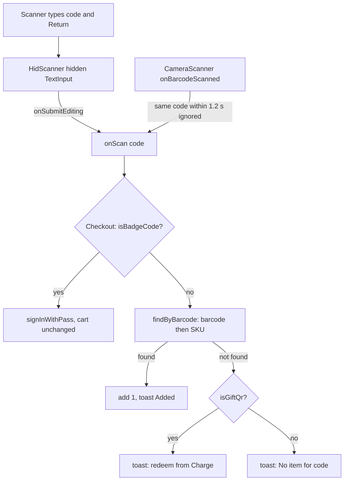

A scan is the quickest way to add an item. The POS understands three kinds of code: item barcodes, cashier passes and gift card QR codes.

## Basic

### The two scanners
- **Bluetooth scanner.** Pair it in the iPad's own Settings as a keyboard (HID mode). After that, on Checkout, just scan: the item goes in the cart.
- **Camera.** Tap the camera icon next to the search bar. A full-screen camera opens and stays open, so you can scan several things in a row. Each scan shows a green message ("Added Dragon plush") or a red one ("Not found: …"). Tap **Done** when finished. The camera reads EAN-13, EAN-8, UPC-A, UPC-E, Code 128, Code 39, ITF-14 and QR codes.

The gift card pop-up (Charge ▸ Gift card) has its own camera button for scanning a gift card's QR code.

To check a Bluetooth scanner is working, go to Settings ▸ **Hardware** and scan something. The last few scans are listed and nothing is added to any cart.

### What a scan does, by screen
| Where you are | Item barcode | Cashier pass | Gift card QR |
|---|---|---|---|
| **Checkout** | Adds 1 to the cart | Signs that person in; the cart stays as it is | Tells you to redeem it from Charge ▸ Gift card |
| **Price check / Stock check** | Shows its price or stock; the cart is not touched | "That is a cashier pass, not an item." | Tells you to check it from Charge ▸ Gift card |
| **Staff sign-in** | Not accepted | Signs in | Not accepted |

If nothing matches you see **No item for** followed by the code. Fix that in Shopify (see Advanced for the usual causes).

### When scanning does nothing
- A pop-up is open, or you are on another screen (such as Pay). Scanning only adds to the cart from the Checkout screen with nothing on top of it.
- You were typing in a box a moment ago. Scans are ignored for about 2½ seconds after you finish typing, so the scanner cannot take over what you were typing.
- The scanner is not paired or not in keyboard mode. Test it in Settings ▸ Hardware.

### Getting the on-screen keyboard back
A Bluetooth scanner stops the iPad showing its on-screen keyboard. On the POS-mate scanner, **double-click the scanner button** to show the keyboard, and double-click again to hide it.

## Deep

### How a code is matched
The code is compared with each variation's **barcode** after removing spaces and any zeros at the start. That is why a 12-digit UPC and the 13-digit EAN that begins with 0 find the same item. If no barcode matches, the code is tried against each **SKU** exactly, ignoring capital letters. If two items share a barcode, the first one found wins, so keep barcodes unique.

### The order things are checked
Checkout asks "is it a cashier pass?" first, then "is it an item?", then "is it a gift card?". The Price check and Stock check pop-ups ask "is it an item?" first, so a real barcode always wins there. A pass is the letter P followed by 12 letters and digits. A gift card QR starts with `shopify-giftcard-v1-`. Because no item should ever look like either, the order rarely matters.

### Why a scanner acts like a keyboard
A Bluetooth scanner connected this way pretends to be a keyboard: it types the digits and then presses Return. The POS keeps a hidden, always-ready text box that catches those keystrokes, and treats Return as "scan finished". This is also why a scanner can fight with a real keyboard, and why the POS backs off while you type.

### Two scans of the same code
The camera ignores the same code if it is seen again within about a second, so holding the camera on one barcode does not add ten.

## Advanced

### The path of a scan

### Where the code is
| Job | Where |
|---|---|
| Hidden keyboard capture, camera screen | `src/screens/Scanner.tsx` (`HidScanner`, `CameraScanner`) |
| When Checkout listens | `Checkout.tsx`: `HidScanner enabled={active && nav.tab === 'checkout' && sheet === 'none' && !cam && nav.stack.length === 0}` |
| Matching | `findByBarcode`, `normaliseBarcode` in `src/lib/cartOps.ts` (strips whitespace and leading zeros; then SKU, lower-cased) |
| Pass, gift, none | `resolveScan`, `scanProblem` in `src/lib/lookup.ts`; `isBadgeCode`, `cleanScan`, `BADGE_RE` (`/^P[0-9A-HJKMNP-TV-Z]{12}$/`) in `src/lib/badge.ts`; `isGiftQr` in `src/lib/giftCode.ts` |
| Not stealing the keyboard | `src/lib/focusGuard.ts` (`isUserTyping`, `TYPING_GRACE_MS` = 2500); every `Field` calls `fieldFocused` and `fieldBlurred` |
| Price and Stock check | `src/screens/Lookup.tsx` (`HidScanner enabled={visible && !cam}`) |
| Sign-in screen | `src/screens/StaffLogin.tsx` (only passes accepted) |
| Hardware test | `HardwareTest` in `Settings.tsx` (keeps the last 8 scans) |
| Tests | `tests/focusguard.test.ts`, `tests/lookup.test.ts` |

### How HidScanner keeps focus
It only takes focus when `isUserTyping()` is false and `Keyboard.isVisible()` is false. It tries on mount and then every 1.5 seconds if it has lost focus. The text box is 1 pixel, almost invisible, hides the soft keyboard (`showSoftInputOnFocus={false}`), and is replaced (new `key`) after every scan so the old text can never leak into the next code. The code used is `nativeEvent.text`, falling back to the last typed value, trimmed.

### Reading the code for a fault
- **"No item for …" on a real product.** The variation has no `barcode` or `sku` on this device, or the value differs by more than spaces and leading zeros. A Shopify barcode with letters or a dash will not match a scan without them. Fix it in Shopify, then import again in Settings ▸ Shopify.
- **Scan works in Settings ▸ Hardware but not on Checkout.** One of the five conditions in the `enabled` expression is false: a sheet is open, the camera is up, a screen is stacked on top, or the tab is not Checkout.
- **Scan is ignored just after typing.** Working as designed (`TYPING_GRACE_MS`). Wait about 2½ seconds.
- **The keyboard disappears while typing.** That was a bug fixed in patch 0001; if it returns, check that the input in question is a kit `Field` (a raw `TextInput` is invisible to the guard, though `Keyboard.isVisible()` still covers it).
- **The same item is added twice.** The scanner sent the code twice, or its trigger was held. The camera path de-duplicates within 1.2 seconds; the Bluetooth path does not.
- **Characters come out wrong.** The scanner's keyboard layout does not match the iPad's. Change it with the scanner's setup barcodes, not in the app.
