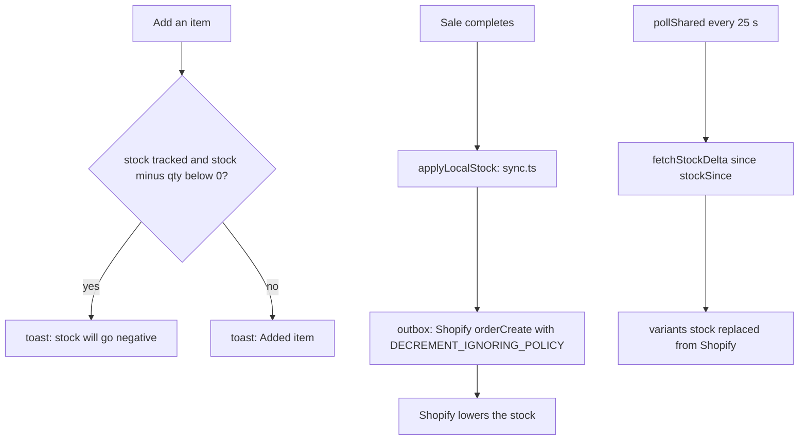

A product can come in several variations, such as colour or size. Each variation has its own price and its own stock count.

## Basic

### Choosing a variation
Tap a product that has more than one variation and the grid is replaced by one tile per variation. Each shows its photo, name, price and stock. Tap the one you want and it goes in the cart, and you are back where you were. The bar above shows the product as the last step, for example *Home > Dragons > Highland cow*, so tap an earlier name to leave without choosing.

A product with only one variation skips this step and is added straight away.

### What the stock words mean
| You see | It means |
|---|---|
| **12 in stock** | There are 12 counted. |
| **Out of stock** | The count is 0. |
| **3 oversold** | The count is below zero: 3 more have been sold than were counted. |
| **Not tracked** | This item has no stock count (a service, or tracking is off in Shopify). |

The coloured dot follows the same idea: green is fine, amber is 2 or fewer (including 0), and red is oversold.

### Selling when stock is 0
You can always sell an item that shows 0 or below. The POS warns you ("stock will go negative") and carries on, because the shelf is the truth and the count may simply be behind.

### When the count changes
- Selling an item lowers its count straight away on this device.
- A refund puts it back.
- Counts also change when someone on another register or in Shopify changes them. The app checks about every 25 seconds while it is open.
- If any item goes below zero, a notification appears in the Notifications tab that takes you to Inventory so you can fix the count.

### Fixing a wrong count
Counts are corrected in Inventory (set a count, receive stock, or adjust it). If many items look wrong after a busy day, check that sales are not queued: the strip on Checkout says "Offline" or "queued" when they are.

## Deep

### Why overselling is allowed
Shopify is told to take the stock off even if that makes it negative. A till that refused to sell would stop a customer who is standing there with the item in their hand, so the rule is: sell first, correct the count after.

### Not tracked
A variation whose stock is "not tracked" never shows a dot, is never counted in totals, and is not changed by sales or refunds. This is not the same as 0.

### Stock check totals
The Stock check tile shows the scanned variation first, then its siblings, and a total. The total only adds counts that are tracked, and treats negative counts as 0, so oversold stock does not pull the total down. It also says how many variations are not tracked, in brackets after the total.

### Several registers
Each register keeps its own copy of the counts and applies its own sales at once, so the number you see is right for you immediately. The real number lives in Shopify and each register catches up every 25 seconds or so. Two registers selling the last item at the same moment will both succeed, and the count will go to -1.

## Advanced

### Data and thresholds
`Variant.stock` is `number | null` (`null` = not tracked). The thresholds are in two places that agree: `stockToneOf` in `src/lib/lookup.ts` (`none`, `ok`, `low` at 1 to 2, `out` at 0, `neg` below 0) and `stockTone` in `src/state/selectors.ts` for the tile dot (which has no separate `out`, so 0 shows as low).

### When stock moves

- `applyLocalStock` changes the local count for each sold line by `-qty` for a sale, `+qty` for a refund, skipping untracked variations.
- Shopify's own count is lowered by the order itself (`DECREMENT_IGNORING_POLICY`), so the POS does not send a second adjustment for sales.
- For refunds the outbox item carries `done: { order, stock }` and the stock step uses `adjustStock` in `src/lib/shopify/inventory.ts` (`inventoryAdjustQuantities` with an idempotency key, so a retry cannot apply twice).
- `pollShared` fetches stock changes since `stockSince` and replaces the matching variants' counts. Remote values win, which is how the count is corrected after a manual change in Shopify.
- `App.tsx` runs a 25-second tick that polls, empties the outbox, and raises the "N item(s) with negative stock" notice (route `inventory`).

### The picker
`VariantPicker` in `Tiles.tsx` draws one tile per variation using `pickerVariants` (catalogue order, no duplicate ids) and `stockText`. It is a level of the grid, not a popup: `pickerCrumbs` adds the product as the last crumb, and changing tab, page, path or edit mode closes it (the `useEffect` that calls `setVariants(null)` in `Checkout.tsx`).

### Reading the code for a fault
- **Count did not drop after a sale.** The variation is untracked (`stock === null`), or `inventoryItemId` is missing so a later `pollShared` cannot match it. Check the variant on the device.
- **Count jumped back after a sale.** `pollShared` replaced it with Shopify's number; the order has probably not reached Shopify yet (outbox not empty).
- **Stock dot differs from the picker word.** Expected at exactly 0: the tile dot is amber for low, the picker says Out of stock.
- **Tests.** `tests/lookup.test.ts` covers the tones, the words, the stock check totals and the picker helpers.
