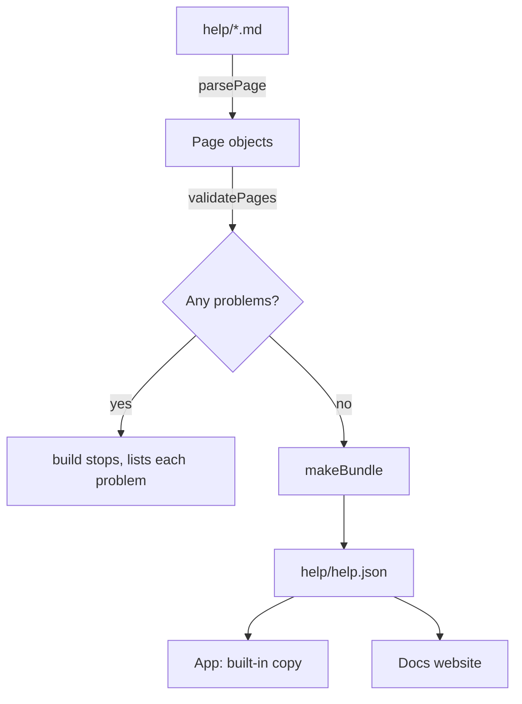

This help explains every part of the POS: what each screen is for, how to do each job, what the messages mean, and what to do when something goes wrong.

## Basic

### Finding what you need
- Open the **Help** screen (More ▸ Help). Pages are grouped by job: selling, taking payment, the cash drawer, gift cards, orders and refunds, stock, staff, settings, and fixing problems.
- Use the search box at the top. Type a word or two ("refund", "card declined") and every word has to match.
- A page ends with **Related pages**. Words in blue take you to another page.

### Choosing how much detail you want
Every page has up to three levels. You pick one and the Help screen remembers it.

| Level | What you get |
|---|---|
| **Basic** | What you need to know to do the job. Start here. |
| **Deep** | Basic, plus a plain-English look at how it works, so the odd behaviours make sense. |
| **Advanced** | Everything above, plus the code behind it, flowcharts, and how to trace a fault that the screen cannot fix. |

A deeper level always includes the levels above it, so you never have to read two copies of a page.

### If a page is missing or wrong
Tell the person who looks after the POS. The pages are ordinary text files, so a fix is a small edit and shows up everywhere (the app and the website) at once.

## Deep

### One set of pages, two places to read them
The pages are Markdown files kept in one folder. The app has a copy built in, so it works with no internet, and the docs website serves the same files. Because both read the same source, they cannot drift apart. When a page changes, its fingerprint (a short code) changes too, so a device can tell whether it has the latest.

### How pages are organised
Each page has a **parent**, which makes the folders-inside-folders shape you see on the Help screen. Pages also point at each other with links, and each page shows the pages that link to it. Nothing is listed by hand: the contents list is built from the parents, so a new page appears in the right place the moment it exists.

### Checks before a page is accepted
A page cannot be added to the set unless its links all go somewhere, its parent exists, it has a Basic section, and its code blocks are closed. This is why you should not meet a dead link while reading.

## Advanced

### Where things live
| What | Where |
|---|---|
| The pages | `help/**/*.md` (a page is `help/<folder>/<name>.md`; a folder's own page is `index.md`) |
| Format, parsing, checks, search | `src/lib/helpDocs.ts` (pure, no React) |
| Build and check script | `scripts/build-help.ts` (`npm run help:build`, `npm run help:check`) |
| What the app and the website read | `help/help.json` (generated, do not edit by hand) |
| Tests | `tests/helpdocs.test.ts` |
| Notes for people writing pages | `help/README.md` |

### The page format
A page is a header, an optional lead, and up to three sections:

```text
---
id: sales/cart-and-prices
title: The cart and how prices are worked out
parent: sales
summary: One line for lists and search.
tags: [cart, discount]
related: [pay]
updated: 2026-10-11
---
Lead text, shown at every depth.
## Basic
## Deep
## Advanced
```

Rules the checker enforces (`validatePages`): the `id` must match the file path (`sales/index.md` is `sales`, `start.md` is `start`); every page except `start` has a `parent` that exists, with no loops; every `[[link]]` and every `related` entry must point at a real page; `## Basic` must be present; code fences must close; and `##` is reserved for the three depth headings, so inside a section you use `###`.

### How the pieces fit


### Showing a page at a depth
`selectDepth(page, depth)` returns the lead, then each section down to the chosen depth. `resolveLinks` turns `[[id|text]]` into a real link for whichever viewer is showing it, and leaves plain text if the id is unknown, so raw brackets never reach the screen. `searchPages` requires every word to match and ranks title and tag matches above body matches. `buildIndex` gives the parent/child tree and the "pages that link here" lists; `trail` gives the path from the top page down to a page.

### Tracing a problem
- A page is not showing up: run `npm run help:check`. It prints every problem with the file name.
- The app shows an old page: compare `version` in `help/help.json` with the one the app holds (`readBundle` rejects a bundle it cannot use, and the app then keeps its built-in copy).
- A link is plain text instead of a link: the id in `[[...]]` does not exist, so `resolveLinks` printed only its text. The checker would have refused it, so look for a page that was deleted or renamed after the link was written.
